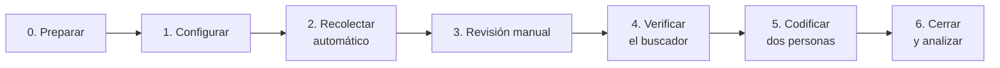

# Medición de la transparencia activa y la divulgación de los ODS en los Gobiernos Regionales de Chile

Código y protocolo para repetir, con el mismo método, la medición del artículo *¿Transparencia nominal o efectiva? Divulgación de los ODS y trazabilidad del gasto en los Gobiernos Regionales de Chile* (Salazar Pincheira, Morales Parada y Hollander Sanhueza, 2026).

Cada medición, llamada **ronda**, cubre los 16 Gobiernos Regionales (GORE) en tres dimensiones: el índice de fiscalización del Consejo para la Transparencia (CPLT), la disponibilidad efectiva de 15 categorías en el Portal de Transparencia y la divulgación de los Objetivos de Desarrollo Sostenible (ODS) en el sitio web, la Estrategia Regional de Desarrollo (ERD) y la cuenta pública de cada GORE. Este documento reúne todo lo necesario para repetirla: la instalación, el protocolo de rondas, las reglas de medición, la revisión manual y el contenido de cada archivo.

> **Summary in English.** Code and protocol to replicate the measurement used in the paper above. Each measurement round covers Chile's 16 Regional Governments (GORE): the official active-transparency index of the Council for Transparency (CPLT), the actual availability of 15 mandatory categories on the national Transparency Portal (web scraping), and the disclosure of the Sustainable Development Goals (SDGs) on each GORE's website, Regional Development Strategy and annual public account, double-coded as rhetorical or substantive. A manual-review protocol covers what the code cannot find, and every closed round is stored with SHA-256 fingerprints. Documentation is in Spanish.

**Contenido:** [Instalación](#instalación) · [Protocolo de rondas](#protocolo-de-rondas) · [Reglas de medición](#reglas-de-medición) · [Revisión manual](#revisión-manual) · [Archivos de una ronda](#archivos-de-una-ronda) · [Estructura](#estructura) · [Pruebas](#pruebas) · [Publicar una versión](#publicar-una-versión) · [Limitaciones](#limitaciones) · [Licencia y cita](#licencia-y-cita)

## Qué incluye

| Etapa | Qué hace | Código |
|---|---|---|
| Índices del CPLT | Reúne los índices de fiscalización por año y los compara | `codigo/cplt_informes.py` |
| Portal de Transparencia | Recorre las 15 categorías de los artículos 6.° y 7.° de la Ley N.° 20.285 en cada GORE y calcula la disponibilidad | `codigo/portal_scraping.py`, `codigo/portal_indice.py` |
| ODS en sitios web y documentos | Busca los términos en los sitios web, la ERD y la cuenta pública, y verifica cada resultado | `codigo/ods_web.py`, `codigo/ods_documentos.py`, `codigo/ods_terminos.py` |
| Revisión manual | Lista lo que el código no pudo encontrar o verificar y registra la búsqueda a mano | `codigo/revision_manual.py` |
| Codificación | Planilla para que dos personas clasifiquen cada mención por separado; acuerdo con κ de Cohen | `codigo/ods_codificacion.py` |
| Cierre y análisis | Datos en formato estándar con huella SHA-256, fiabilidad, intervalos de Wilson, pruebas entre años y comparación con la ronda anterior | `codigo/cerrar_ronda.py`, `codigo/analisis_ronda.py`, `codigo/ods_graficos.py` |

Las planillas que se llenan a mano están en blanco en [`plantillas/`](plantillas/).

## Instalación

Requiere Python 3.12 o superior.

```bash
python3 -m venv .venv && source .venv/bin/activate      # Windows: .venv\Scripts\activate
python -m pip install --upgrade pip
python -m pip install -r requirements.txt               # versiones exactas; si falla: requirements-min.txt
python -m playwright install chromium                   # navegador para el Portal de Transparencia
```

Para leer PDF escaneados (OCR), instale además Tesseract con español y Poppler (macOS: `brew install tesseract tesseract-lang poppler`; Ubuntu: `sudo apt install tesseract-ocr tesseract-ocr-spa poppler-utils`).

Antes de recolectar, escriba su correo en `config/contacto.txt` (una línea; hay un ejemplo en `config/contacto.txt.ejemplo`). Los sitios lo ven en cada visita, y el archivo no se sube a GitHub.

Compruebe la instalación con las pruebas, que no necesitan internet: `python ejecutar_todo.py pruebas`.

## Protocolo de rondas

### En resumen

Una **ronda** es una medición completa de los 16 Gobiernos Regionales (GORE): la disponibilidad de la transparencia activa en el Portal de Transparencia del Estado y la divulgación de los Objetivos de Desarrollo Sostenible (ODS) en tres fuentes (sitio web, Estrategia Regional de Desarrollo y cuenta pública). Este protocolo permite que **cualquier persona** repita la medición con el mismo método y obtenga resultados comparables con la ronda `2026-1`, que es la del paper.

| | |
|---|---|
| **Qué se necesita** | Un computador con Python 3.12 o superior, conexión a internet y este repositorio |
| **Personas** | Mínimo dos (ver [Roles](#roles)) |
| **Tiempo** | 3 a 4 jornadas: medio día automático, un día de revisión manual, uno o dos de codificación y una hora de cierre |
| **Resultado** | `mediciones/AAAA-N/` (datos con huella SHA-256) y `resultados/AAAA-N/` (análisis y figuras), comparables con las rondas anteriores |



Una ronda completa, en cuatro comandos (el detalle está en los pasos):

```bash
python ejecutar_todo.py recolectar --etiqueta 2027-06-15     # automático: CPLT, Portal, ODS y planilla de revisión manual
python ejecutar_todo.py plantilla --etiqueta 2027-06-15      # después de la revisión manual: planilla de codificación
python ejecutar_todo.py cerrar 2027-2 --etiqueta 2027-06-15 \
       --fecha-scraping "15 de junio de 2027" --fecha-ods "17 al 25 de junio de 2027"
python ejecutar_todo.py verificar 2027-2                     # comprueba que los datos no cambiaron después del cierre
```

Cada script de `codigo/` acepta `--help`, y la mayoría acepta `--gore AB098 AB081` para trabajar con algunos GORE.

### Roles

| Rol | Qué hace | Pasos |
|---|---|---|
| **Responsable de la ronda** | Prepara el entorno, actualiza la configuración, corre la recolección, cierra la ronda y documenta | 0, 1, 2, 6 |
| **Revisor/a manual** | Resuelve los casos que el código no pudo encontrar o verificar | 3 |
| **Segundo/a revisor/a** | Confirma los documentos «No disponible» y repite la muestra del buscador, sin ver el trabajo anterior | 3, 4 |
| **Codificador/a 1 y codificador/a 2** | Clasifican cada mención por separado y luego acuerdan el consenso | 5 |

Una misma persona puede tener varios roles, con dos condiciones: los dos codificadores son personas distintas y trabajan sin ver la codificación del otro, y el segundo revisor no es quien hizo la revisión manual.

### Cuándo medir

La medición se puede repetir en cualquier fecha. Para comparar entre rondas conviene:

- **Recorrer todo el Portal en un mismo día**, o en días consecutivos, y anotar la fecha.
- **Medir después de que se publiquen las cuentas públicas.** En 2026 se presentaron entre mayo y julio; una ronda anterior a esas fechas mide la cuenta del año previo.
- **Nombrar la ronda** con el año, un guion y el número de ronda del año (`2027-1`, `2027-2`). Así las rondas se ordenan solas y el análisis compara cada una con la anterior.
- **Para comparar con el artículo,** copie los datos de la ronda `2026-1` en `mediciones/2026-1/` antes de cerrar la nueva ronda. Si no los tiene, la ronda se analiza igual, sin comparación.

### Pasos

#### 0. Preparar el entorno (30 minutos) · Responsable

- [ ] Descargue la última versión del repositorio (o `git pull` si ya lo tiene).
- [ ] Instale el entorno (ver [Instalación](#instalación)).
- [ ] Escriba su correo en `config/contacto.txt` (una línea). Los sitios lo ven en cada visita.
- [ ] Corra las pruebas: `python ejecutar_todo.py pruebas`. Deben terminar en `OK`; si no, no siga y revise el error.

#### 1. Actualizar la configuración (1 hora) · Responsable

- [ ] Abra `config/gores.csv` y compruebe, GORE por GORE, que las URL del sitio, la ERD y la cuenta pública sigan funcionando. Si un GORE publicó una ERD o una cuenta pública nueva, reemplace la URL y anótelo en `CHANGELOG.md`.
- [ ] Si el Consejo para la Transparencia (CPLT) publicó resultados nuevos: `python codigo/cplt_informes.py agregar AÑO archivo.csv` y registre la fuente en `config/cplt_informes.csv`.
- [ ] **No cambie** los términos de búsqueda (`codigo/ods_terminos.py`), las categorías del Portal ni las reglas de puntaje. Si es imprescindible, cambie la versión mayor del código (ver [Publicar una versión](#publicar-una-versión)) y explíquelo, porque la serie deja de ser comparable.

#### 2. Recolectar (automático, 2 a 4 horas) · Responsable

```bash
python ejecutar_todo.py recolectar --etiqueta 2027-06-15
```

La etiqueta es la fecha de la recolección. El comando recorre el Portal, busca los ODS en los sitios y documentos, y genera la planilla de revisión manual.

- [ ] Revise `salidas/robots_bloqueadas_2027-06-15.csv` (si existe): son páginas que el sitio pide no visitar. No use `--ignorar-robots` salvo con una justificación escrita en el informe.

#### 3. Revisión manual (1 día) · Revisor/a manual y segundo/a revisor/a

Siga la [revisión manual](#revisión-manual) con la planilla `salidas/revision_manual_2027-06-15.xlsx`.

- [ ] Resuelva cada caso pendiente: celdas ER y SD del Portal, documentos no disponibles o escaneados, sitios sin menciones, páginas bloqueadas y la muestra de control.
- [ ] Registre cada búsqueda manual, aunque no encuentre nada, y cada mención hallada a mano.
- [ ] El segundo revisor confirma, por separado, cada documento «No disponible».
- [ ] Genere la planilla de codificación (valida la revisión e incluye las menciones manuales):

```bash
python ejecutar_todo.py plantilla --etiqueta 2027-06-15
```

#### 4. Verificar el buscador (30 minutos) · Segundo/a revisor/a

- [ ] En la hoja `Muestra_verificacion` de `salidas/codificacion_ods_2027-06-15.xlsx` (5 GORE elegidos al azar con semilla fija), repita la búsqueda en cada sitio y anote el conteo. Criterio: al menos 90 % de coincidencias (±1).

#### 5. Codificar (1 a 2 días) · Codificador/a 1 y codificador/a 2

Las reglas están en [Reglas de medición](#reglas-de-medición). En `plantillas/codificacion_ods_PLANTILLA.xlsx` hay una planilla en blanco.

- [ ] Cada persona llena **solo su columna**, sin mirar la otra, en las hojas `Menciones`, `Documentos` y `Mapa_17_ODS`.
- [ ] Revisen el acuerdo: `python codigo/ods_codificacion.py kappa salidas/codificacion_ods_2027-06-15.xlsx`. Si algún κ es menor que 0,60, discutan los criterios y recodifiquen antes de seguir.
- [ ] Discutan los desacuerdos y llenen las columnas de consenso («Consenso final» y la fila «consenso» del mapa).
- [ ] Si una codificación se apoya en inteligencia artificial, declárenlo en el informe y en la planilla, y mantengan siempre una codificación humana independiente.

#### 6. Cerrar y analizar (1 hora) · Responsable

```bash
python ejecutar_todo.py cerrar 2027-2 --etiqueta 2027-06-15 \
       --fecha-scraping "15 de junio de 2027" --fecha-ods "17 al 25 de junio de 2027"
```

Esto deja:

- `mediciones/2027-2/`: los datos de la ronda en formato estándar (ver [Archivos de una ronda](#archivos-de-una-ronda)), la planilla codificada, los archivos crudos y `manifiesto.json` con la huella SHA-256 de cada archivo, las fechas y las versiones del software.
- `resultados/2027-2/`: `analisis_2027-2.xlsx` (con la comparación con la ronda anterior) y las figuras.
- `resultados/serie_rondas.csv` y `resultados/evolucion_rondas.png`: los indicadores de todas las rondas.

- [ ] Lea la hoja `Resumen` del análisis y compárela con la ronda anterior. Los cambios grandes en un GORE suelen deberse a cambios en su sitio: verifíquelos antes de interpretarlos.
- [ ] Escriba el informe de la ronda: fechas, roles (sin nombres si el informe es anónimo), cambios en `gores.csv`, problemas encontrados y resultado del control de calidad.
- [ ] Guarde `mediciones/2027-2/` y `resultados/2027-2/` donde el equipo lo haya acordado. No se suben a este repositorio; si se publican, conviene archivarlos en Zenodo como conjunto de datos, con su `manifiesto.json`.


## Reglas de medición

**Portal de Transparencia.** Cada categoría vale 1 si tiene una tabla con registros (OK) o un enlace externo que responde (EX), y 0 si está sin datos (SD) o con error (ER). El índice de disponibilidad es el porcentaje de las 15 categorías con valor 1. Solo se guarda el tamaño de cada tabla, nunca su contenido, porque puede incluir datos personales.

**Divulgación de los ODS.**

- **Términos:** «ODS» (en mayúsculas y como palabra completa), «Objetivo(s) de Desarrollo Sostenible», «Agenda 2030» y «ODS 16».
- **Retórica:** menciona los ODS sin vincularlos con objetivos, metas, indicadores o presupuesto del GORE. **Sustantiva:** los vincula. Ante la duda, retórica.
- **Nivel de la ERD:** 0 sin mención, 1 declarativa, 2 vinculación, 3 operacionalizada (ODS asignados a indicadores o presupuesto).
- **Mapa de la ERD:** cada ODS se codifica 2 (vinculado), 1 (solo contexto) o 0 (no se nombra).
- La clasificación la hacen personas: el código encuentra y verifica las menciones, y la columna «Sugerencia automática» es solo una ayuda.
- Los documentos que un sitio bloquea se guardan a mano en `documentos_manuales/` como `{codigo}_erd.pdf` o `{codigo}_cuenta_publica.pdf`, y el código los lee igual.

**Recolección responsable.** Solo información pública, identificación con un correo de contacto, pausas de 1 a 2,5 segundos entre solicitudes y respeto de `robots.txt`. Las páginas que un sitio pide no visitar quedan registradas en `salidas/robots_bloqueadas_FECHA.csv`.

## Revisión manual

El código encuentra la mayor parte de la información, pero no toda. En la ronda 2026-1, por ejemplo:

- recuperó 22 de las 32 menciones web de los ODS; las otras 10 se hallaron a mano porque los buscadores internos de algunos sitios no indexan todas sus páginas;
- descargó 25 de los 30 documentos analizados; los otros 5 los aportó el equipo porque el sitio los bloqueaba o no los enlazaba;
- la cuenta pública 2025 de La Araucanía se registró como «no disponible» porque estaba publicada en un visor embebido (Heyzine) y no como archivo. Se encontró en una revisión posterior.

Este procedimiento hace que esa revisión manual sea **sistemática, registrada y repetible**: se revisan siempre los mismos tipos de casos, con los mismos pasos, y cada búsqueda queda anotada.

### Cuándo se hace

```
recolectar  →  REVISIÓN MANUAL  →  plantilla de codificación  →  codificar  →  cerrar
```

`python ejecutar_todo.py recolectar` genera, al final, `salidas/revision_manual_FECHA.xlsx` con los casos pendientes (hay una versión en blanco en `plantillas/revision_manual_PLANTILLA.xlsx`). Calcule **un día de trabajo** para una persona, más una hora de una segunda persona para confirmar los «no disponible».

### La planilla de revisión

| Hoja | Qué contiene | Quién la llena |
|---|---|---|
| Pendientes | Un caso por fila, generado por el código, con el tipo, el GORE y qué revisar | Revisor 1 (y Revisor 2 para confirmar los «no disponible») |
| Menciones_manuales | Cada página web con mención de los ODS hallada a mano | Revisor 1 |
| Busquedas_manuales | Cada búsqueda hecha a mano, **aunque no encuentre nada** | Revisor 1 |

En Pendientes se llenan las celdas amarillas; en las otras dos hojas se agrega una fila por cada mención o búsqueda. El resultado de cada caso se elige de una lista:

| Resultado | Cuándo usarlo | Evidencia obligatoria |
|---|---|---|
| Confirmado (sin cambios) | La revisión confirma lo que registró el código | No |
| Encontrado a mano | Se halló el documento o la información que el código no encontró | Sí: URL o archivo |
| Corregido | El código se equivocó (por ejemplo, una celda ER que en realidad tiene datos) | Sí: URL o captura |
| No disponible (confirmado por 2) | Dos personas, por separado, no lo encontraron | Firma del Revisor 2 |
| Solo video | El documento existe solo como video | Sí: URL del video |
| No aplica | El caso no corresponde (por ejemplo, el GORE no tiene esa obligación) | Nota |

### Tipos de casos y qué hacer

#### 1. Portal de Transparencia: celdas ER y SD

1. Abra la ficha del GORE: `https://www.portaltransparencia.cl/PortalPdT/directorio-de-organismos-regulados/?org=CÓDIGO`.
2. Entre a la categoría y al período más reciente, como lo haría una persona.
3. **ER** (error o ítem inexistente): si la página carga y tiene datos, es una falla del recorrido. Repita ese GORE con `python codigo/portal_scraping.py --gore CÓDIGO --etiqueta FECHA` y marque «Corregido».
4. **SD** (sin datos): confirme que dice «0 resultados», «no publica información» o está vacía. Revise hasta 3 períodos anteriores.
5. Si cambia el estado, guarde una captura en `salidas/capturas/CÓDIGO_CATEGORÍA_manual.png` y anótela como evidencia.

#### 2. Documentos: ERD y cuenta pública «No disponible» o «Solo video»

Busque en este orden y **anote cada lugar revisado** en Busquedas_manuales:

1. Las URL de `config/gores.csv`, por si solo cambió la dirección.
2. Las secciones del sitio del GORE: «Cuenta pública», «Gestión», «Documentos», «Planificación», «Transparencia».
3. Noticias del sitio cercanas a la fecha de la cuenta pública (normalmente entre mayo y julio).
4. **Visores embebidos** (Heyzine, Issuu, Calaméo, FlipHTML5, Google Drive, Scribd). En Chrome: clic derecho → *Inspeccionar* → pestaña *Red* (Network) → filtrar por `pdf` → recargar la página; el archivo original suele aparecer ahí. Si no se puede descargar, anote la URL del visor.
5. Google: `site:dominio-del-gore.cl "cuenta pública" 2025` y `site:dominio-del-gore.cl "estrategia regional de desarrollo"`.
6. YouTube o redes del GORE, si es una cuenta pública en video.
7. Si nada funciona, la sección de Transparencia Activa del Portal (categoría de documentos de planificación o de gestión).

Si lo encuentra:

- Guarde el PDF en `documentos_manuales/CÓDIGO_erd.pdf` o `documentos_manuales/CÓDIGO_cuenta_publica.pdf`.
- Si ya hay un archivo con ese nombre, reemplácelo solo si el nuevo es más reciente y anótelo en la Nota.
- Repita la lectura: `python codigo/ods_documentos.py --gore CÓDIGO --etiqueta FECHA`.
- Actualice la URL en `config/gores.csv` y anote el cambio en el informe de la ronda.

**«No disponible» solo se acepta si dos personas lo buscaron por separado**, siguiendo esta lista, y ninguna lo encontró. Si existe solo en video, use «Solo video». Opcional: pedirlo por Ley de Transparencia (solicitud de acceso a la información) y anotar el número de la solicitud.

#### 3. Documentos con poco texto por página

Si un documento tiene menos de 300 caracteres por página, probablemente es una imagen escaneada o una presentación.

1. Confirme que el código usó OCR (columna `metodo` de `ods_documentos_FECHA.csv`).
2. Abra el PDF y busque a mano los términos (Ctrl+F; si no es seleccionable, revise los títulos y las láminas).
3. Si encuentra un término que el código no detectó, marque «Corregido» y anote la página.

#### 4. Sitios web sin menciones verificadas

Para cada GORE donde el código no verificó ninguna mención:

1. Use el buscador del sitio con cada término del protocolo: «ODS», «Objetivos de Desarrollo Sostenible», «Agenda 2030» y «ODS 16».
2. Use Google con cada término: `site:dominio-del-gore.cl "ODS"` (repita para cada término).
3. Revise la sección de noticias de los últimos 3 años con la búsqueda del navegador (Ctrl+F).
4. **Verifique cada resultado**: abra la página y confirme que el término está en el texto (no solo en un menú o en una etiqueta). «ODS» debe ir en mayúsculas y como palabra completa.
5. Cada mención verificada va a la hoja Menciones_manuales con su URL, título, fecha, términos y cómo se encontró.
6. Cada búsqueda va a Busquedas_manuales, aunque no dé resultados: así se puede reportar el esfuerzo y otra persona puede repetirla.

#### 5. Páginas bloqueadas por robots.txt

El código no visita las páginas que el sitio pide no recorrer. Revíselas a mano solo si son públicas y relevantes (por ejemplo, una noticia o un documento). No use `--ignorar-robots` para resolver esto.

#### 6. Control de calidad: muestra de documentos «Sin mención»

El código elige al azar 5 documentos clasificados «Sin mención» (semilla fija 2026, para que la muestra sea reproducible). Ábralos y busque a mano los términos. Si todos se confirman, el código es confiable para esa ronda. Si alguno tenía menciones, márquelo «Corregido», revise el resto de los documentos de ese tipo y anótelo en el informe de la ronda.

### Reglas comunes

- **Mismos términos y criterios que el código.** La revisión manual completa la búsqueda; no cambia las reglas.
- **Ventana de búsqueda:** la misma de la ronda. Una página o documento publicado después del cierre de la recolección se anota, pero se usa en la ronda siguiente.
- **Todo con evidencia:** URL, archivo o captura. Lo que no se puede mostrar no se registra como hallazgo.
- **La revisión manual no clasifica.** Solo encuentra y verifica. La clasificación retórica o sustantiva se hace después, en la planilla de codificación, con dos codificadores.

### Cerrar la revisión

```bash
python ejecutar_todo.py plantilla --etiqueta FECHA
```

El código valida la planilla y no sigue si:

- hay casos sin resultado;
- hay «No disponible» sin la confirmación del Revisor 2;
- hay hallazgos sin evidencia;
- hay menciones manuales sin URL o sin términos.

Si todo está completo, exporta tres archivos a `salidas/`:

- `revision_manual_FECHA.csv`
- `ods_menciones_manuales_FECHA.csv`
- `busquedas_manuales_FECHA.csv`

Luego genera la planilla de codificación con las menciones manuales incluidas (identificador `M001`, `M002`…). Al cerrar la ronda, los tres archivos quedan en `mediciones/RONDA/crudos/` con su huella SHA-256.

## Archivos de una ronda

Cada ronda vive en `mediciones/<ronda>/` con estos archivos (CSV en UTF-8, separados por comas). Los genera `codigo/cerrar_ronda.py`; no se editan a mano.

### portal_matriz.csv — Portal de Transparencia (una fila por GORE)

| Columna | Descripción |
|---|---|
| `codigo` | Código del organismo en el Portal (AB075 … AB098) |
| `gore` | Nombre del Gobierno Regional |
| `A` … `M` | Estado de cada categoría de transparencia activa (art. 6.° y 7.° de la Ley N.° 20.285): **OK** tabla con registros · **EX** enlace externo operativo · **SD** sin datos o «no publica» · **ER** error o ítem inexistente |
| `indice` | % de las 15 categorías con OK o EX |

Categorías: A estructura orgánica · B facultades · C marco normativo · D1 planta · D2 contrata · D3 honorarios · E compras · F transferencias · G actos con efectos sobre terceros · H trámites · I subsidios · J participación ciudadana · K presupuesto · L auditorías · M vínculos institucionales.

### ods_menciones.csv — menciones de los ODS (una fila por página web o página de documento)

| Columna | Descripción |
|---|---|
| `id` | W… (sitio web) o D… (pasaje de documento) |
| `codigo`, `gore` | GORE |
| `fuente` | Sitio web · ERD · Cuenta pública |
| `fecha_o_pagina` | Fecha de la noticia o página del documento |
| `titulo_o_documento`, `url` | Título y URL de la página (o identificador del pasaje) |
| `terminos` | Términos encontrados (ODS, Objetivos de Desarrollo Sostenible, Agenda 2030, ODS 16) |
| `sha256_texto` | Huella del texto leído: permite saber si la página cambió desde la ronda |
| `cod1`, `cod2` | Clasificación de cada codificador: **Retórica** (menciona sin vincular) o **Sustantiva** (vincula con objetivos, metas, indicadores o presupuesto) |
| `consenso` | Clasificación final |
| `justificacion` | Nota del codificador 1 |

### ods_documentos.csv — ERD y cuentas públicas (una fila por documento)

| Columna | Descripción |
|---|---|
| `codigo`, `gore`, `fuente` | GORE y tipo de documento (ERD o Cuenta pública) |
| `documento` | Archivo u origen |
| `sha256` | Huella del PDF leído (comprueba que se analizó exactamente ese archivo) |
| `n_<término>` | Número de apariciones de cada término |
| `cod1`, `cod2`, `consenso` | Sustantiva · Retórica · Sin mención · No disponible |

### erd_mapa_ods.csv — mapa ERD × 17 ODS (consenso; una fila por GORE)

| Columna | Descripción |
|---|---|
| `documento` | ERD codificada |
| `nivel` | Integración de los ODS en la ERD: 0 sin mención · 1 declarativa · 2 vinculación (parcial o estratégica) · 3 operacionalizada |
| `ods_1` … `ods_17` | 2 vinculado a eje, objetivo o indicador · 1 solo contexto · 0 no se nombra |

`erd_mapa_ods_codificadores.csv` tiene la codificación independiente en formato largo (`codigo`, `gore`, `ods`, `cod1`, `cod2`).

### ods_resumen_gore.csv — resumen por GORE

`web_retoricas`, `web_sustantivas` (n.º de menciones web) · `cuenta_publica`, `erd_clasificacion` (mejor clasificación del documento) · `erd_documento` · `erd_nivel`.

### fiabilidad.csv

`medida`, `n`, `acuerdo` (proporción de coincidencias), `kappa` (κ de Cohen). Criterio: κ ≥ 0,60 aceptable; ≥ 0,80 muy bueno.

### manifiesto.json

Nombre de la ronda, fecha de cierre (UTC), fechas de recolección y codificación, versión de Python, sistema y librerías, y la huella SHA-256 y el tamaño de cada archivo de la carpeta.

### Otros archivos de la ronda

`codificacion.xlsx` (planilla codificada original) · `config_gores.csv` (configuración usada) · `crudos/` (salidas sin procesar de los scripts, con fechas y horas de cada consulta).

### Archivos fuera de las rondas

| Archivo | Contenido |
|---|---|
| `datos/referencia_cplt.csv` | Índice de transparencia activa del CPLT por GORE y año (`cplt_2024`, …) |
| `config/gores.csv` | Por GORE: sitio web, tipo de buscador, URL de búsqueda y de listado, URL de la cuenta pública y de la ERD |
| `config/cplt_informes.csv` | Fuente de cada año del CPLT |
| `resultados/serie_rondas.csv` | Indicadores principales de todas las rondas (se crea al analizar) |
| `plantillas/` | Planillas de revisión manual y de codificación en blanco |
| `tests/datos/` | Salidas de ejemplo de la recolección automática (29-09-2026) para las pruebas |

## Estructura

```
ejecutar_todo.py        punto de entrada: recolectar, plantilla, cerrar, analizar, verificar, pruebas
codigo/                 un archivo por tarea
config/                 gores.csv (sitios, buscadores y URL de ERD y cuentas públicas) · cplt_informes.csv · contacto.txt
datos/                  referencia_cplt.csv: índices del CPLT por GORE y año
plantillas/             planillas de revisión manual y de codificación, en blanco
tests/                  pruebas automáticas y datos de ejemplo
documentos_manuales/    PDF aportados a mano en cada ronda (no se versionan)
salidas/                resultados crudos de cada recolección (no se versionan)
mediciones/, resultados/  datos y análisis de cada ronda cerrada (se crean al cerrar; no se versionan)
```

## Pruebas

`python ejecutar_todo.py pruebas` comprueba que las reglas de búsqueda, el índice, el κ de Cohen y el respeto de `robots.txt` no cambiaron sin querer. También simula dos rondas completas (revisión manual, codificación, cierre, análisis y verificación) con los datos de ejemplo de `tests/datos/`, que son las salidas de la recolección automática del 29 de septiembre de 2026. Las pruebas corren en GitHub en cada cambio, junto con una revisión del estilo del código ([ruff](https://docs.astral.sh/ruff/), configuración en `pyproject.toml`).


## Limitaciones

- Los sitios cambian: revise `config/gores.csv` antes de cada ronda.
- Si el Portal cambia los nombres de sus ítems, ajuste `CATEGORIAS` en `codigo/portal_scraping.py`.
- El CPLT y el Portal miden aspectos distintos; compárelos como instrumentos, no como una misma serie.

## Licencia y cita

Código bajo licencia MIT (`LICENSE`); `config/`, `datos/`, las plantillas y los datos de ejemplo bajo CC BY 4.0 (`LICENSE-datos`). Para citar, ver `CITATION.cff`.
