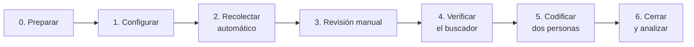

# Protocolo de rondas de medición

## En resumen

Una **ronda** es una medición completa de los 16 Gobiernos Regionales (GORE): la disponibilidad de la transparencia activa en el Portal de Transparencia del Estado y la divulgación de los Objetivos de Desarrollo Sostenible (ODS) en tres fuentes (sitio web, Estrategia Regional de Desarrollo y cuenta pública). Este protocolo permite que **cualquier persona** repita la medición con el mismo método y obtenga resultados comparables con la ronda `2026-1`, que es la del paper.

| | |
|---|---|
| **Qué se necesita** | Un computador con Python 3.12 o superior, conexión a internet y este repositorio |
| **Personas** | Mínimo dos (ver [Roles](#roles)) |
| **Tiempo** | 3 a 4 jornadas: medio día automático, un día de revisión manual, uno o dos de codificación y una hora de cierre |
| **Resultado** | `mediciones/AAAA-N/` (datos con huella SHA-256) y `resultados/AAAA-N/` (análisis y figuras), comparables con las rondas anteriores |



## Roles

| Rol | Qué hace | Pasos |
|---|---|---|
| **Responsable de la ronda** | Prepara el entorno, actualiza la configuración, corre la recolección, cierra la ronda y documenta | 0, 1, 2, 6 |
| **Revisor/a manual** | Resuelve los casos que el código no pudo encontrar o verificar | 3 |
| **Segundo/a revisor/a** | Confirma los documentos «No disponible» y repite la muestra del buscador, sin ver el trabajo anterior | 3, 4 |
| **Codificador/a 1 y codificador/a 2** | Clasifican cada mención por separado y luego acuerdan el consenso | 5 |

Una misma persona puede tener varios roles, con dos condiciones: los dos codificadores son personas distintas y trabajan sin ver la codificación del otro, y el segundo revisor no es quien hizo la revisión manual.

## Cuándo medir

La medición se puede repetir en cualquier fecha. Para comparar entre rondas conviene:

- **Recorrer todo el Portal en un mismo día**, o en días consecutivos, y anotar la fecha.
- **Medir después de que se publiquen las cuentas públicas.** En 2026 se presentaron entre mayo y julio; una ronda anterior a esas fechas mide la cuenta del año previo.
- **Nombrar la ronda** con el año, un guion y el número de ronda del año (`2027-1`, `2027-2`). Así las rondas se ordenan solas y el análisis compara cada una con la anterior.

## Pasos

### 0. Preparar el entorno (30 minutos) · Responsable

- [ ] Descargue la última versión del repositorio (o `git pull` si ya lo tiene).
- [ ] Instale el entorno (ver «Instalación» en el [README](../README.md)).
- [ ] Escriba su correo en `config/contacto.txt` (una línea). Los sitios lo ven en cada visita.
- [ ] Corra las pruebas: `python ejecutar_todo.py pruebas`. Deben terminar en `OK`; si no, no siga y revise el error.

### 1. Actualizar la configuración (1 hora) · Responsable

- [ ] Abra `config/gores.csv` y compruebe, GORE por GORE, que las URL del sitio, la ERD y la cuenta pública sigan funcionando. Si un GORE publicó una ERD o una cuenta pública nueva, reemplace la URL y anótelo en `CHANGELOG.md`.
- [ ] Si el Consejo para la Transparencia (CPLT) publicó resultados nuevos: `python codigo/cplt_informes.py agregar AÑO archivo.csv` y registre la fuente en `config/cplt_informes.csv`.
- [ ] **No cambie** los términos de búsqueda (`codigo/ods_terminos.py`), las categorías del Portal ni las reglas de puntaje. Si es imprescindible, cambie la versión mayor del código (ver [PUBLICAR.md](PUBLICAR.md)) y explíquelo, porque la serie deja de ser comparable.

### 2. Recolectar (automático, 2 a 4 horas) · Responsable

```bash
python ejecutar_todo.py recolectar --etiqueta 2027-06-15
```

La etiqueta es la fecha de la recolección. El comando recorre el Portal, busca los ODS en los sitios y documentos, y genera la planilla de revisión manual.

- [ ] Revise `salidas/robots_bloqueadas_2027-06-15.csv` (si existe): son páginas que el sitio pide no visitar. No use `--ignorar-robots` salvo con una justificación escrita en el informe.

### 3. Revisión manual (1 día) · Revisor/a manual y segundo/a revisor/a

Siga el [protocolo de revisión manual](PROTOCOLO_REVISION_MANUAL.md) con la planilla `salidas/revision_manual_2027-06-15.xlsx`.

- [ ] Resuelva cada caso pendiente: celdas ER y SD del Portal, documentos no disponibles o escaneados, sitios sin menciones, páginas bloqueadas y la muestra de control.
- [ ] Registre cada búsqueda manual, aunque no encuentre nada, y cada mención hallada a mano.
- [ ] El segundo revisor confirma, por separado, cada documento «No disponible».
- [ ] Genere la planilla de codificación (valida la revisión e incluye las menciones manuales):

```bash
python ejecutar_todo.py plantilla --etiqueta 2027-06-15
```

### 4. Verificar el buscador (30 minutos) · Segundo/a revisor/a

- [ ] En la hoja `Muestra_verificacion` de `salidas/codificacion_ods_2027-06-15.xlsx` (5 GORE elegidos al azar con semilla fija), repita la búsqueda en cada sitio y anote el conteo. Criterio: al menos 90 % de coincidencias (±1).

### 5. Codificar (1 a 2 días) · Codificador/a 1 y codificador/a 2

Las reglas están en la hoja `Instrucciones` de la planilla y en el apartado «Divulgación de los ODS» del [README](../README.md).

- [ ] Cada persona llena **solo su columna**, sin mirar la otra, en las hojas `Menciones`, `Documentos` y `Mapa_17_ODS`.
- [ ] Revisen el acuerdo: `python codigo/ods_codificacion.py kappa salidas/codificacion_ods_2027-06-15.xlsx`. Si algún κ es menor que 0,60, discutan los criterios y recodifiquen antes de seguir.
- [ ] Discutan los desacuerdos y llenen las columnas de consenso («Consenso final» y la fila «consenso» del mapa).
- [ ] Si una codificación se apoya en inteligencia artificial, declárenlo en el informe y en la planilla, y mantengan siempre una codificación humana independiente.

### 6. Cerrar y analizar (1 hora) · Responsable

```bash
python ejecutar_todo.py cerrar 2027-2 --etiqueta 2027-06-15 \
       --fecha-scraping "15 de junio de 2027" --fecha-ods "17 al 25 de junio de 2027"
```

Esto deja:

- `mediciones/2027-2/`: los datos de la ronda en formato estándar (ver [DICCIONARIO_DATOS.md](DICCIONARIO_DATOS.md)), la planilla codificada, los archivos crudos y `manifiesto.json` con la huella SHA-256 de cada archivo, las fechas y las versiones del software.
- `resultados/2027-2/`: `analisis_2027-2.xlsx` (con la comparación con la ronda anterior) y las figuras.
- `resultados/serie_rondas.csv` y `resultados/evolucion_rondas.png`: los indicadores de todas las rondas.

- [ ] Lea la hoja `Resumen` del análisis y compárela con la ronda anterior. Los cambios grandes en un GORE suelen deberse a cambios en su sitio: verifíquelos antes de interpretarlos.
- [ ] Anote la ronda en `CHANGELOG.md`: fechas, roles (sin nombres si el informe es anónimo), cambios en `gores.csv` y problemas encontrados.
- [ ] Publique la versión (ver [PUBLICAR.md](PUBLICAR.md)): commit, etiqueta `ronda-2027-2` y nueva versión en Zenodo.

## Corregir una ronda cerrada

Una ronda cerrada no se edita a mano sin dejar registro. `python ejecutar_todo.py verificar 2027-2` detecta cualquier cambio posterior al cierre.

- **Si el error está en la codificación:** corrija la planilla y vuelva a cerrar con `python ejecutar_todo.py cerrar 2027-2 --etiqueta 2027-06-15 --forzar`.
- **Si después del cierre aparece un documento que no se había encontrado:** guarde el documento en `documentos_manuales/`, corrija la fila en `mediciones/RONDA/`, anote en `manifiesto.json` (campo `correcciones`) la fecha, el motivo, la huella del documento y los archivos cambiados, actualice las huellas y rehaga el análisis con `python ejecutar_todo.py analizar RONDA`. Así se corrigió la cuenta pública de La Araucanía en la ronda `2026-1` (ver `CHANGELOG.md`).

En ambos casos, explique la corrección en `CHANGELOG.md` y compruebe con `python ejecutar_todo.py verificar RONDA` que la ronda queda íntegra.

## Reglas que no se cambian

1. **Dos codificadores independientes** y consenso documentado en cada ronda.
2. **Mismos términos, categorías y reglas de puntaje** que en `2026-1`, salvo cambio de versión mayor.
3. **Solo información pública.** No se guarda el contenido de las tablas del Portal (puede tener datos personales), solo su existencia y su tamaño.
4. **Respeto de robots.txt** y pausas de 1 a 2,5 segundos entre solicitudes.
5. **Toda corrección queda registrada** en el manifiesto y en `CHANGELOG.md`.

## Anexo: el visor del equipo

El visor web (`docs/index.html`, publicado con GitHub Pages) es una iniciativa del equipo para mostrar los resultados; **no es necesario para replicar la medición**. Quien repita el estudio puede ignorarlo.

El equipo mantiene el visor así:

- Cada vez que se cierra una ronda, `cerrar` también regenera el visor.
- Entre rondas, el equipo repite solo el recorrido del Portal (no requiere codificación) para mantener el visor al día: `python ejecutar_todo.py actualizar --publicar`, o en GitHub, *Actions* → **Actualizar Portal y visor** → *Run workflow*. Esas mediciones quedan en `actualizaciones/portal/` con su fecha, método y huella SHA-256, y se muestran en la pestaña **Disponibilidad en el Portal** del visor. No forman parte de las rondas ni de sus análisis.
- Para regenerar el visor sin medir: `python ejecutar_todo.py visor`.
